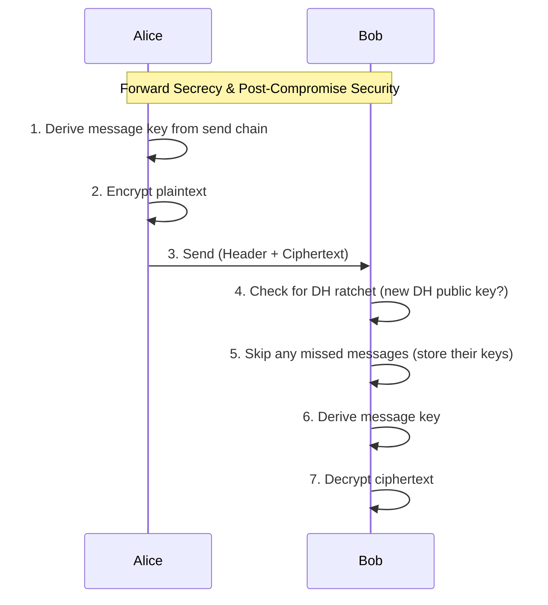

# **GoRatchet**: A Double Ratchet Implementation

A straightforward and easy-to-understand Go implementation of the [Double Ratchet Algorithm](https://signal.org/docs/specifications/doubleratchet/), designed for clarity and ease of integration into Go projects requiring robust end-to-end encryption.

> [!CAUTION]
> This implementation is not intended for production use. It is provided for educational purposes only. _Use at your own risk._

## Features

- **Full Double Ratchet Implementation**: Adheres strictly to the Signal Protocol's Double Ratchet Algorithm specification, providing robust forward secrecy and post-compromise security for end-to-end encrypted messaging sessions.

- **Standardized Cryptography**: Utilizes Go's built-in, cryptographically secure packages:
  - `crypto/ecdh` for elliptic curve Diffie-Hellman key exchange (P-256 curve)
  - `crypto/aes` with GCM mode for authenticated encryption
  - HKDF (HMAC-based Key Derivation Function) for secure key derivation

- **Resilient Message Handling**: 
  - Gracefully handles out-of-order message delivery
  - Automatic recovery of skipped message keys (up to 1000 messages)
  - Protection against replay attacks through message key deletion after use
  - Configurable maximum skip limit to prevent memory exhaustion

- **Thread-Safe Operations**: All public methods are protected by mutexes, enabling safe concurrent access from multiple goroutines.

- **Session Persistence**: Built-in serialization and deserialization support for saving and restoring session state.

- **Developer-Friendly API**: Minimalist and intuitive API centered around `Send` and `Receive` methods, abstracting away complex cryptographic operations.

- **Zero External Dependencies**: Uses only Go standard library packages, ensuring minimal attack surface and easy maintenance.

## Installation

```bash
go get github.com/othonhugo/goratchet
```

**Requirements:**
- Go 1.21 or higher (for `crypto/ecdh` support)

## Quick Start

```go
package main

import (
    "crypto/ecdh"
    "crypto/rand"
    "fmt"
    "log"

    "github.com/othonhugo/goratchet"
)

func main() {
    // Generate identity keys for both parties
    alicePri, _ := ecdh.P256().GenerateKey(rand.Reader)
    bobPri, _ := ecdh.P256().GenerateKey(rand.Reader)

    // Initialize sessions
    alice, err := goratchet.New(alicePri.Bytes(), bobPri.PublicKey().Bytes(), nil)
    if err != nil {
        log.Fatal(err)
    }

    bob, err := goratchet.New(bobPri.Bytes(), alicePri.PublicKey().Bytes(), nil)
    if err != nil {
        log.Fatal(err)
    }

    // Alice sends a message
    ciphered, err := alice.Send([]byte("Hello, Bob!"), nil)
    if err != nil {
        log.Fatal(err)
    }

    // Bob receives the message
    unciphered, err := bob.Receive(ciphered, nil)
    if err != nil {
        log.Fatal(err)
    }

    fmt.Printf("Decrypted message: %s\n", unciphered.Plaintext)
}
```

## Usage Examples

### Basic Message Exchange

The following example demonstrates bidirectional message exchange between Alice and Bob:

```go
// Alice sends to Bob
msg1, _ := alice.Send([]byte("Hello Bob"), nil)
plaintext1, _ := bob.Receive(msg1, nil)
fmt.Println(string(plaintext1.Plaintext)) // "Hello Bob"

// Bob replies to Alice
msg2, _ := bob.Send([]byte("Hi Alice"), nil)
plaintext2, _ := alice.Receive(msg2, nil)
fmt.Println(string(plaintext2.Plaintext)) // "Hi Alice"
```

### Using Associated Data

Associated Data (AD) provides additional authenticated context without being encrypted. This is useful for metadata like message IDs, timestamps, or sender information:

```go
// Create associated data (e.g., message metadata)
ad := []byte("message-id:12345,timestamp:1234567890")

// Send with associated data
ciphered, _ := alice.Send([]byte("Secret message"), ad)

// Receive with the same associated data
unciphered, _ := bob.Receive(ciphered, ad)

// Attempting to receive with different AD will fail
_, err := bob.Receive(ciphered, []byte("wrong-metadata"))
// err != nil (authentication failure)
```

### Session Serialization

Save and restore session state for persistent storage:

```go
// Serialize Alice's session
stateBytes, err := alice.Serialize()
if err != nil {
    log.Fatal(err)
}

// Save to file, database, etc.
err = os.WriteFile("alice_session.json", stateBytes, 0600)
if err != nil {
    log.Fatal(err)
}

// Later, restore the session
stateBytes, err = os.ReadFile("alice_session.json")
if err != nil {
    log.Fatal(err)
}

restoredAlice, err := goratchet.Deserialize(stateBytes)
if err != nil {
    log.Fatal(err)
}

// Continue using the restored session
msg, _ := restoredAlice.Send([]byte("I'm back!"), nil)
```

### Out-of-Order Message Handling

The Double Ratchet protocol automatically handles messages received out of order:

```go
// Alice sends multiple messages
msg1, _ := alice.Send([]byte("Message 1"), nil)
msg2, _ := alice.Send([]byte("Message 2"), nil)
msg3, _ := alice.Send([]byte("Message 3"), nil)

// Bob receives them out of order (3, 1, 2)
plaintext3, _ := bob.Receive(msg3, nil) // "Message 3"
plaintext1, _ := bob.Receive(msg1, nil) // "Message 1"
plaintext2, _ := bob.Receive(msg2, nil) // "Message 2"

// All messages are correctly decrypted
```

**Note:** The protocol can skip up to `MaxSkip` (1000) messages. Attempting to skip more will return an error to prevent memory exhaustion attacks.

## How It Works

The Double Ratchet algorithm provides two critical security properties:

### Forward Secrecy
Old messages cannot be decrypted even if current session keys are compromised. Each message is encrypted with a unique key that is immediately deleted after use.

### Post-Compromise Security
If session keys are compromised, security is automatically restored after the next Diffie-Hellman ratchet step (when either party sends a message with a new DH public key).

### The Two Ratchets

The algorithm combines two ratcheting mechanisms:

1. **Diffie-Hellman Ratchet**: 
   - Generates new DH key pairs periodically
   - Performs key exchange with the remote party's public key
   - Updates the root key based on the new shared secret
   - Provides post-compromise security

2. **Symmetric-Key Ratchet**:
   - Derives per-message keys from chain keys
   - Advances the chain key after each message
   - Maintains separate send and receive chains
   - Provides forward secrecy

### Message Flow



## API Reference

### Types

#### `DoubleRatchet` Interface

```go
type DoubleRatchet interface {
    // Send encrypts plaintext with optional associated data
    Send(plaintext, ad []byte) (CipheredMessage, error)
    
    // Receive decrypts a ciphered message with optional associated data
    Receive(msg CipheredMessage, ad []byte) (UncipheredMessage, error)
    
    // Serialize marshals the session state to bytes
    Serialize() ([]byte, error)
}
```

#### `CipheredMessage`

```go
type CipheredMessage struct {
    Header     Header  // Message header with DH public key and counters
    Ciphertext []byte  // Encrypted message content
}
```

#### `Header`

```go
type Header struct {
    DH []byte  // Sender's current DH public key
    N  uint32  // Message number in current sending chain
    PN uint32  // Number of messages in previous sending chain
}
```

#### `UncipheredMessage`

```go
type UncipheredMessage struct {
    Plaintext []byte  // Decrypted message content
}
```

### Functions

#### `New(localPri, remotePub, salt []byte) (*doubleRatchet, error)`

Creates a new Double Ratchet session.

**Parameters:**
- `localPri`: Local party's ECDH private key (32 bytes for P-256)
- `remotePub`: Remote party's ECDH public key (65 bytes for P-256 uncompressed)
- `salt`: Optional salt for key derivation (can be `nil`)

**Returns:** Initialized session or error

#### `Deserialize(data []byte) (*doubleRatchet, error)`

Restores a session from serialized state.

**Parameters:**
- `data`: JSON-encoded session state

**Returns:** Restored session or error

### Constants

```go
const MaxSkip = 1000  // Maximum number of messages that can be skipped
```

### Best Practices

1. **Key Management**: 
   - Generate keys using `crypto/rand.Reader`
   - Never reuse private keys across sessions
   - Securely delete keys from memory when done

2. **Associated Data**:
   - Include message metadata (IDs, timestamps) in AD
   - Verify AD matches expected values on receive

3. **Session Persistence**:
   - Encrypt serialized state before storing
   - Use appropriate file permissions (0600)
   - Implement secure deletion when removing sessions

4. **Error Handling**:
   - Never ignore errors from `Send` or `Receive`
   - Log authentication failures for security monitoring
   - Implement rate limiting to prevent DoS attacks

5. **Network Integration**:
   - Always use TLS for transport
   - Implement message ordering and deduplication at transport layer
   - Handle network failures gracefully

## Testing

The project includes comprehensive test coverage across all packages:

```bash
# Run all tests
go test ./...

# Run tests with coverage
go test -cover ./...

# Run tests with race detection
go test -race ./...

# Run fuzz tests (requires Go 1.18+)
go test -fuzz=FuzzReceiveWithMalformedInput -fuzztime=30s ./pkg/doubleratchet

# Run long-running tests
go test -v ./pkg/doubleratchet -run TestLongRunningSessionWithNetworkConditions
```

### Test Coverage

- **Core Protocol Tests**: Basic message exchange, ratchet steps, out-of-order delivery
- **Concurrency Tests**: Thread-safety verification with concurrent operations
- **Security Tests**: Duplicate message rejection, AD authentication, max skip enforcement
- **Cryptographic Tests**: Encryption/decryption, key derivation, DH operations
- **Fuzz Tests**: Robustness against malformed input
- **Simulation Tests**: Long-running sessions with realistic network conditions

## Contributing

Contributions are welcome! This is an educational project, so clarity and correctness are prioritized over performance optimizations.

**Areas for contribution:**
- Additional usage examples
- Documentation improvements
- Test coverage expansion
- Bug fixes
- Code clarity improvements

Please open an issue before starting work on major changes.

## License

This project is licensed under the MIT License - see the [LICENSE](LICENSE) file for details.

---

## References

- [The Double Ratchet Algorithm](https://signal.org/docs/specifications/doubleratchet/) - Signal Protocol Specification
- [The X3DH Key Agreement Protocol](https://signal.org/docs/specifications/x3dh/) - Initial key exchange
- [RFC 5869](https://tools.ietf.org/html/rfc5869) - HKDF specification
- [NIST SP 800-56A](https://csrc.nist.gov/publications/detail/sp/800-56a/rev-3/final) - Elliptic Curve Cryptography

## Acknowledgments

This implementation is based on the Double Ratchet Algorithm specification by Trevor Perrin and Moxie Marlinspike, used in the Signal Protocol.
